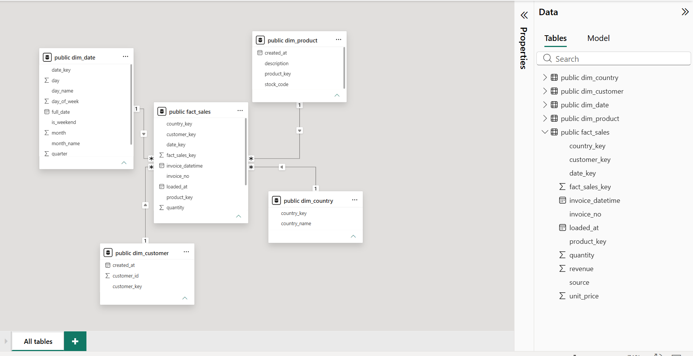
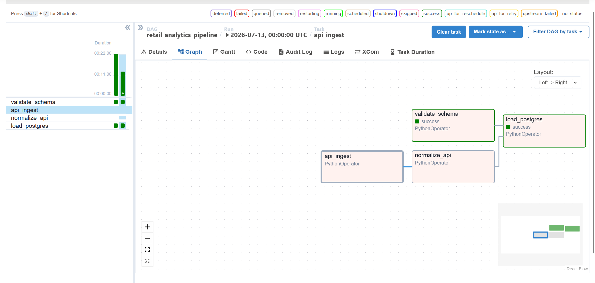

# Retail Analytics Data Pipeline

[](https://github.com/ArnavModi-MSIT/retail-analytics-pipeline/actions/workflows/ci.yml)

A dual-source ETL pipeline that ingests historical CSV bulk data and a live daily API feed, validates every row with PySpark, orchestrates the load with Airflow, and lands both sources in a Postgres star schema for Power BI reporting.

**[Live project page →](https://arnavmodi-msit.github.io/retail-analytics-pipeline/)** &nbsp;·&nbsp; **[Live dashboard →](https://app.powerbi.com/view?r=eyJrIjoiYzZkMTA2MzYtNjEzZi00Y2U3LWE2N2YtNDAwZTcwNmQ4Zjg3IiwidCI6IjNiMjk5M2Q3LTQ5YmYtNGYyOS1iNzk0LWRkNTcyN2Y0NWVlMiJ9)**

---

## What it does

Two ingestion paths run independently, get validated against the same schema-quality rules, and merge into a single fact table:

- **CSV** — [Online Retail II (UCI)](https://www.kaggle.com/datasets/mashlyn/online-retail-ii-uci), ~1.07M UK e-commerce transactions, loaded and validated as a historical bulk batch.
- **API** — [DummyJSON `/carts`](https://dummyjson.com/carts), pulled daily as a live incremental feed, normalized into the same schema shape as the CSV source.

Both paths run through the same PySpark validation logic — every row is bucketed into `valid`, `returns`, or `quarantine`. Nothing is silently dropped.

## Architecture

```
CSV bulk ──┐
           ├──▶ PySpark validation ──▶ Postgres star schema ──▶ Power BI
API daily ─┘        (schema-checked)      (4 dims + 1 fact)
```

Orchestrated by **Airflow** (Docker, LocalExecutor) — 4 tasks, 2 parallel branches, daily schedule, 3 retries, email alert on failure.

| Stage | Tool | What happens |
|---|---|---|
| Ingest | Python / `requests` | CSV historical load + daily API pull, landed untouched |
| Validate | PySpark | Type casting, null/negative-price checks, return detection |
| Normalize | PySpark | API source remapped to the CSV source's column shape |
| Orchestrate | Airflow | Parallel branches merge before the load step |
| Load | PySpark + JDBC | Dimension dedup, surrogate key resolution, truncate-and-load into Postgres |
| Report | Power BI | Direct Postgres connection, Import mode |

## Data at a glance

| Metric | Value |
|---|---|
| Raw CSV rows ingested | 1,067,371 |
| Valid CSV rows loaded | 805,620 |
| Quarantined (documented, not dropped) | 22.7% |
| Daily API rows merged | 800 |
| Products (deduplicated by mode) | 4,820 |
| Unique customers | 6,089 |
| Countries | 42 |
| Total `fact_sales` rows | 806,420 |

## Star schema

Four dimensions (`dim_date`, `dim_product`, `dim_customer`, `dim_country`), one fact table (`fact_sales`) at invoice-line-item grain. A `source` column on the fact table tracks which pipeline branch each row came from.



## Orchestration



## Getting started

**Prerequisites:** Docker Desktop, Python 3.11, PostgreSQL (local instance for the warehouse — separate from Airflow's own metadata Postgres, which runs in Docker).

```bash
git clone https://github.com/ArnavModi-MSIT/retail-analytics-pipeline.git
cd retail-analytics-pipeline

# Local Python environment (for running scripts directly / testing)
python -m venv .venv
.venv\Scripts\activate          # Windows
pip install -r requirements.txt

# Environment config — copy and fill in real values
cp .env.local.example .env          # for local `python` runs
cp .env.docker.example .env.docker  # for the Airflow containers

# Warehouse schema
psql -U postgres -d retail_analytics -f sql/ddl.sql
psql -U postgres -d retail_analytics -f sql/populate_dim_date.sql

# Orchestration
docker compose up airflow-init
docker compose up -d
```

Airflow UI: `http://localhost:8080` (default `admin` / `admin`, set during `airflow-init`). Trigger `retail_analytics_pipeline` from the DAGs list.

## Testing

```bash
pip install -r requirements-dev.txt
ruff check .
pytest tests/ -v
```

CI runs lint, unit tests, DAG import validation, and a Docker build check on every push — see [`.github/workflows/ci.yml`](.github/workflows/ci.yml).

> PySpark's local worker sockets can be unreliable on native Windows (a known PySpark/Windows limitation). If `pytest` hangs or times out locally, trust CI's Ubuntu runner — the same suite passes cleanly there.

## Known limitations

Documented deliberately, not discovered accidentally:

- **Truncate-and-load, not incremental.** Every run reloads dimensions and the fact table from scratch. Correct for this scale and demo purpose; a production version would need merge/upsert logic and slowly-changing dimensions.
- **API source has fabricated fields.** DummyJSON has no `Country` or invoice-style ID — defaulted to `"Unknown"` and a synthesized `API-{cart_id}` respectively. See [`transform/normalize_api_source.py`](transform/normalize_api_source.py) docstring.
- **Storage abstraction is partially scaffolded.** A local/S3 backend interface exists ([`ingestion/storage_backend.py`](ingestion/storage_backend.py)) and is used for path resolution, but the Spark-level read/write methods aren't yet exercised end-to-end. AWS S3 integration is intentionally deferred to a later phase.
- **API customer IDs aren't namespace-protected** against the CSV source the way `StockCode` and `Invoice` are. No collision today given current ID ranges — a known, low-risk simplification.

## Tech stack

Python · PySpark · Apache Airflow · PostgreSQL · Docker Compose · Power BI · GitHub Actions · pytest · ruff

## Project structure

```
├── dags/                  # Airflow DAG
├── ingestion/              # API ingestion + storage backend abstraction
├── transform/               # PySpark validation, normalization, load logic
├── sql/                      # DDL, dim_date population, migrations
├── tests/                     # pytest suite (validation, dedup, DAG import)
├── docs/                       # GitHub Pages project site
├── docker-compose.yml
├── Dockerfile               # Airflow + JDK 17 (PySpark requirement)
└── .github/workflows/ci.yml
```

## Author

**Arnav Modi** — B.Tech Information Technology, Maharaja Surajmal Institute of Technology
